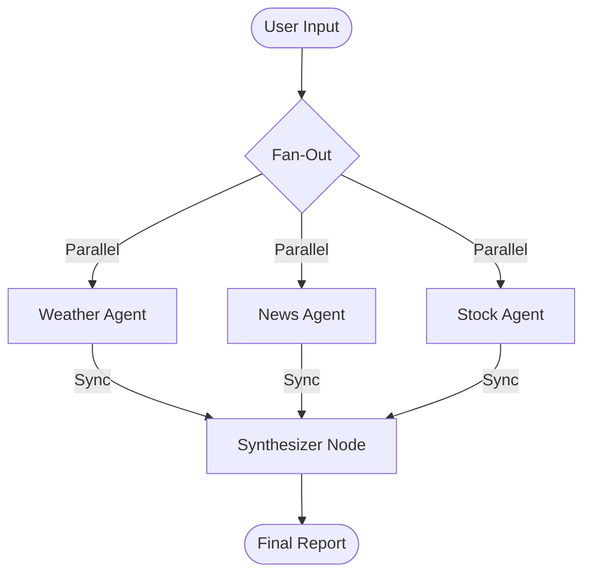

git clone [https://github.com/Himanshu040604/PregelFlow.git](https://github.com/Himanshu040604/PregelFlow.git)
pip install -r requirements.txt

# PregelFlow


**PregelFlow** is a modular, clean-architecture Python project that demonstrates a multi-agent system using **LangGraph**. It leverages the Pregel architecture (bulk synchronous parallel processing) to orchestrate three independent agents—Weather, News, and Stock Market—to fetch real-time data in parallel, synchronize their state, and generate a comprehensive intelligence report.

---

## Architecture

The system operates on a **Plan → Execute → Update** cycle. Unlike sequential scripts, PregelFlow executes all data fetching agents simultaneously in a single "super-step." Below is a simple diagram of the flow:



### Key Concepts

- **Nodes as Actors:** Independent units of logic for fetching specific data types.
- **Channels:** Broadcast mechanisms that send the user's topic to all actors at once.
- **Super-steps:** Parallel execution steps where the graph waits for all agents to finish before moving to synthesis.
- **Persistence:** SQLite checkpointing saves the conversation state, allowing for memory across interactions.

---

## Tech Stack

**Core:**
- LangGraph: Agent orchestration and state management
- Asyncio & aiohttp: Non-blocking, asynchronous I/O for high performance
- SQLite (aiosqlite): Persistent memory storage

**Data Sources & APIs:**
- OpenWeatherMap: Real-time weather data
- NewsAPI: Global headlines and topic search
- Yahoo Finance (yfinance): Real-time market data
- Wikipedia: Scraped for ticker symbol lookup (using pandas & requests)

---

## Project Structure
```text
PregelFlow/
├── main.py                  # Entry point (Async loop & DB connection)
├── .env                     # API Keys (Not tracked by Git)
│
├── graph/                   # The Brain (LangGraph Logic)
│   ├── builder.py           # Graph construction & blueprint
│   ├── nodes.py             # Agent functions (Weather, News, Stock)
│   └── state.py             # Shared memory schema (TotalState)
│
├── services/                # The Tools (Raw Logic)
│   ├── weather.py           # API Wrapper
│   ├── news.py              # API Wrapper
│   └── stock.py             # Scraper & API Wrapper
│
└── database/                # Runtime Storage
    └── checkpoints.db       # Persistent SQLite memory file
```

---

## Setup Instructions

1. **Clone the Repository**
    ```bash
    git clone https://github.com/Himanshu040604/PregelFlow.git
    cd PregelFlow
    ```
2. **Create a Virtual Environment**
    - **Windows:**
      ```powershell
      python -m venv venv
      venv\Scripts\activate
      ```
    - **Mac/Linux:**
      ```bash
      python3 -m venv venv
      source venv/bin/activate
      ```
3. **Install Dependencies**
    ```bash
    pip install -r requirements.txt
    ```
4. **Configure Environment Variables**
    Create a `.env` file in the root directory:
    ```ini
    OPENWEATHER_API_KEY=your_key_here
    NEWS_API_KEY=your_key_here
    # Yahoo Finance does not require an API key.
    ```
    Get keys here: [OpenWeatherMap](https://openweathermap.org/api) | [NewsAPI](https://newsapi.org/)
5. **Run the Application**
    ```bash
    python main.py
    ```

---

## Example Output
```text
Multi-Agent System Initialized (Persistent Memory)
---------------------------------------------------------
Enter Topic: London

Processing...
   Fetching Weather...
   Fetching News...
   Fetching Market Data...

[Final Intelligence Report Generated Below]
...
```

---

## License
MIT License

---

**Note:** Ensure your API keys are kept private and not shared publicly.